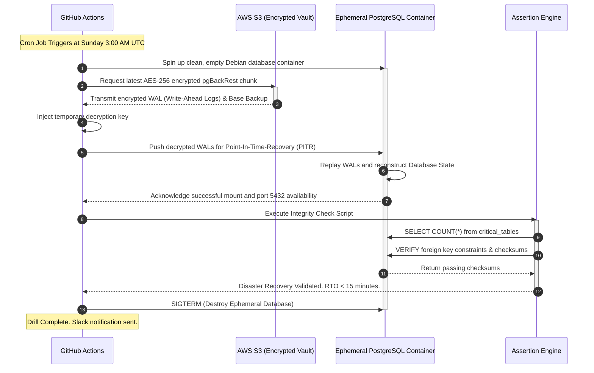
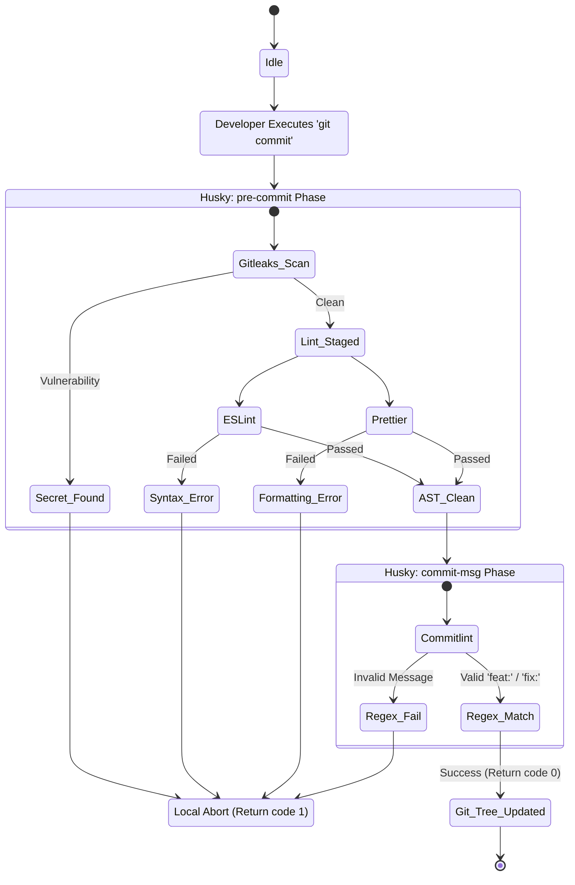

# System Architecture & Topological Diagrams

> Proprietary High-Assurance Zero-Trust CI/CD Ecosystem

This document contains exhaustive visual representations of the CI/CD pipeline infrastructure, including the Main Pipeline Flow, Disaster Recovery Sequences, and Security State Machines.

To view these diagrams, use a Markdown reader that natively supports `mermaid.js` (such as GitHub, GitLab, or VS Code with a Markdown preview extension).

---

## 1. Main Pipeline Topology: The 12-Phase DAG

The following flowchart maps the exact journey of a single commit from a developer's local machine, through the GitHub Actions Cloud Gauntlet, and into the Production Environment.

```mermaid
%%{init: {'theme': 'dark', 'themeVariables': { 'primaryColor': '#1a1a2e', 'edgeLabelBackground':'#0f3460', 'tertiaryColor': '#e94560'}}}%%
graph TD
    %% LOCAL BOUNDARY: The Developer Machine
    subgraph Developer_Workstation [Phase 0: The Local Airgap Boundary]
        direction TB
        Code_Commit([Developer triggers 'git commit']) --> Husky_Pre_Commit{Husky pre-commit Hook}
        Husky_Pre_Commit -->|Triggers| Gitleaks_Local[Gitleaks Secret Scanner]
        Gitleaks_Local -- If Leaks Found --> Local_Abort_1[Abort Commit: Protect AWS/DB Secrets]
        Gitleaks_Local -- Pass --> Lint_Staged[Lint-Staged]
        Lint_Staged --> ESLint[ESLint: JS/TS AST Analysis]
        Lint_Staged --> Prettier[Prettier: Stylistic Formatting]

        ESLint & Prettier --> Husky_Commit_Msg{Husky commit-msg Hook}
        Husky_Commit_Msg --> Commitlint[Commitlint: Semantic Check]
        Commitlint -- Fail --> Local_Abort_2[Abort Commit: Require 'feat:' or 'fix:' prefix]
        Commitlint -- Pass --> Local_Git_Tree[(Local .git Object Tree)]
    end

    %% CLOUD BOUNDARY: Asynchronous GitHub Actions
    subgraph Cloud_CI_Environment [Phase 1-4: The Cloud Static Gauntlet]
        direction TB
        Local_Git_Tree -->|Git Push Origin| GitHub_Trigger((GitHub Event: Push / PR))
        GitHub_Trigger --> Phase1_Auth{Phase 1: Deep Static Checks}

        Phase1_Auth --> Cloud_Gitleaks[Cloud Gitleaks: Full History Scan]
        Phase1_Auth --> Semgrep_SAST[Semgrep: OWASP Top 10 Dataflow Analysis]
        Phase1_Auth --> Bandit_Python[Bandit: Python AST Deserialization Check]

        Cloud_Gitleaks & Semgrep_SAST & Bandit_Python --> Phase2_SCA{Phase 2: Supply Chain Security}
        Phase2_SCA --> NPM_Audit[NPM Audit: JS Transitive Vulnerabilities]
        Phase2_SCA --> Pip_Safety[Pip Safety: Python Vulnerabilities]
        Phase2_SCA --> Anchore_Grype[Anchore Grype: Global CVE Index Scan]

        NPM_Audit & Pip_Safety & Anchore_Grype --> Phase3_Testing{Phase 3: Logic Verification}
        Phase3_Testing --> Pytest_Cov[Pytest: 80% Coverage Enforcement]
        Phase3_Testing --> Hypothesis[Hypothesis: Chaos Fuzzing]

        Pytest_Cov & Hypothesis --> Phase4_IaC{Phase 4: Container & IaC}
        Phase4_IaC --> Hadolint[Hadolint: Dockerfile Security Scan]
        Phase4_IaC --> Checkov[Checkov: Terraform/S3 Exposure Scan]
        Hadolint --> Docker_Build[Docker Daemon: Build Immutable Image]
        Docker_Build --> Trivy_Scan[Trivy: Alpine/Debian OS CVE Scan]
    end

    %% DYNAMIC DEPLOYMENT: Staging & Resilience
    subgraph DAST_and_Load_Testing [Phase 5-7: The Active War Zone]
        direction TB
        Checkov & Trivy_Scan --> Deploy_Staging[(Deploy to Ephemeral Staging Server)]

        Deploy_Staging --> Phase5_DAST{Phase 5: Active Penetration Testing}
        Phase5_DAST --> ZAP_Spider[OWASP ZAP: Active Payload Injection]
        Phase5_DAST --> Nikto[Nikto: Web Server Misconfiguration Scan]
        Phase5_DAST --> Mozilla_Obs[Mozilla Observatory: HSTS & CSP Headers]

        Phase5_DAST --> Phase6_Resilience{Phase 6: Load & Chaos Testing}
        Phase6_Resilience --> K6_Load[k6: 50 VU Concurrency DDoS Simulation]
        Phase6_Resilience --> LHCI[Lighthouse CI: Core Web Vitals Audit]

        Phase6_Resilience --> Phase7_A11y{Phase 7: Legal Compliance}
        Phase7_A11y --> Pa11y_CI[PA11Y-CI: WCAG 2.1 AA Screen Reader Tests]
        Pa11y_CI --> Playwright[Playwright: Chromium/WebKit E2E DOM Tests]
    end

    %% PRODUCTION & DAY 2 OPERATIONS
    subgraph Production_Day_2 [Phase 8: SOC2 Production & Operations]
        direction TB
        Playwright --> Merge_Gate{Approval Gate: All Checks Passed}
        Merge_Gate -->|Promote Immutable Image| Prod_Deploy[(Deploy to Production Server)]

        Prod_Deploy --> Day_2_Cron{Day-2 Operations Cron}
        Day_2_Cron --> Nightly_Mutmut[Nightly 2:00 AM: Mutmut Code Sabotage Tests]
        Day_2_Cron --> Sunday_DR[Sunday 3:00 AM: pgBackRest PITR Drill]
    end

    %% Edge styling
    classDef security fill:#990000,stroke:#fff,stroke-width:2px,color:#fff;
    classDef static fill:#003366,stroke:#fff,stroke-width:2px,color:#fff;
    classDef dynamic fill:#cc6600,stroke:#fff,stroke-width:2px,color:#fff;
    classDef compliance fill:#006600,stroke:#fff,stroke-width:2px,color:#fff;
    classDef local fill:#333333,stroke:#fff,stroke-width:2px,color:#fff;

    class Gitleaks_Local,Cloud_Gitleaks,Semgrep_SAST,Bandit_Python,NPM_Audit,Pip_Safety,Anchore_Grype,Checkov,Hadolint,Trivy_Scan,ZAP_Spider,Nikto,Mozilla_Obs security;
    class ESLint,Prettier,Commitlint,Pytest_Cov,Hypothesis static;
    class K6_Load,LHCI,Playwright dynamic;
    class Pa11y_CI compliance;
    class Code_Commit,Husky_Pre_Commit,Husky_Commit_Msg local;

```

---

## 2. Automated Disaster Recovery (DR) Sequence Diagram

The following sequence diagram outlines the exact cryptographic and logical steps taken during the Sunday 3:00 AM Automated Disaster Recovery Drill. This proves the system's ability to achieve a strict Recovery Time Objective (RTO).

---

## 3. The Local Git Hook State Machine

This state diagram explains the strict control flow that governs a developer's local machine, enforcing code quality before network bandwidth is even consumed.

